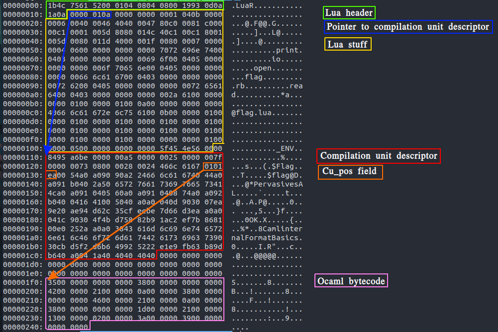

# bytecoooding

## Description

if u thought shellcoding was fun, wait until you try bytecoooding
Threshold starts at 8, and decrements by 1 approximately every 5 hours.

bytecoooding.challenges.ooo 5000

bytecode-docker.tar.gz 

## Overview

In this challenge you have to make a bytecode polyglot file for the languages: jvm, python3, python2, ruby, lua, nodejs, ocaml and elisp.
The polyglot had to open the file "flag" in the current directory and print its content to stdout.

This was a "golf"-challenge, so the initial threshold for solving the challenge was to make a single polyglot for all the 8 languages. The threshold would then go down by 1 every 5 hours of the competition. So after 10 hours you only had to make a polyglot for 6 of the languages and so on. After the first team solves the challenge the threshold is locked at how many languages they managed to solve it with.

The service asks you for at most 4096 bytes. It then saves it in a file called `bytecode`. It then tries to execute it using the specific environment for each language. For some languages it prepends a couple of bytes before executing. For example magic headers for python2/3 .pyc files, ruby, lua and so on. For more exact details about the problem, see bytecode-docker.tar.gz.

[Me](https://twitter.com/mgrenfeldt) and [zzz](https://twitter.com/viktoredstrom), playing for [NorseCode](https://ctftime.org/team/110823), solved it using 4 languages (python2, python3, lua, ocaml) and got first blood! Only one other team managed to solve it during the competition: /bin/tw

## Solution

## Python2 and Python3

So we naturally started with trying to combine python2 and python3. You would assume they are similar enough to be easy to combine. The server prepends the 4 magic bytes for a python2 or python3 `.pyc`-file for us before running it using `python[2|3] bytecode`. So we started digging into the `.pyc`-format to try and make a polyglot.

After some digging in the python source code we find the format of `.pyc`-files in both python2 and 3. To find it we looked at the [source code](https://github.com/python/cpython/blob/2.7/Lib/compileall.py#L61) for the `compileall` module since it can be used to create `pyc`-files.

```
python2.7 pyc file format:
- magic header            - 4 bytes - 03F30D0A 
- timestamp last modified - 4 bytes
- marshalled code object

python3.6 pyc file format:
- magic header            - 4 bytes - 330D0D0A
- timestamp last modified - 4 bytes
- size of source code     - 4 bytes
- marshalled code object
```

Relevant links:
- https://github.com/python/cpython/blob/2.7/Lib/py_compile.py#L71
- https://github.com/python/cpython/blob/3.6/Lib/py_compile.py#L65
- https://github.com/python/cpython/blob/3.6/Lib/importlib/_bootstrap_external.py#L497

Okay, pretty similar, the only thing that differs is the `size of source code` field. Promising! Let's look at the structure of the marshalled code object. You can find the structure of this by looking into the source code of the `marshal` module

```
python2/3 code object:
- object type    1 bytes - 'c' for code object
- argcount       4 bytes
- kwonlyargcount 4 bytes - ONLY EXISTS IN PYTHON 3
- nlocals        4 bytes
- stacksize      4 bytes
- flags          4 bytes
- code string    v bytes
- consts         v bytes
- names          v bytes
- varnames       v bytes
- freevars       v bytes
- cellvars       v bytes
- filename       v bytes
- name           v bytes
- firstlineno    4 bytes
- lnotab         v bytes

NOTE: v means variable number of bytes. Check the links below for more details.
```

Relevant links:
- https://github.com/python/cpython/blob/2.7/Python/marshal.c#L996
- https://github.com/python/cpython/blob/3.6/Python/marshal.c#L1347

So the code objects are also very similar, nice! Note the `object type` field. It is a one byte field that has to be `c` for code objects. And we have to have a code object according to the `pyc` format. For python3 this field also contains a 1 bit flag in the MSB so it can be `c` or `\xe3`. But if we try to make a polyglot the `argcount` field in python2 and the `object type` field in python3 will overlap. In the example shown below this means that the `c` or `\xe3` of python3 will make the `argcount` of python2 very big (or negative), since it is stored in little endian.

```
Offset | python2     | python3
------------------------------------------
0      | magic       | magic
1      | magic       | magic
2      | magic       | magic
3      | magic       | magic
4      | timestamp   | timestamp
5      | timestamp   | timestamp
6      | timestamp   | timestamp
7      | timestamp   | timestamp
8      | object type | size of source code
9      | argcount    | size of source code
10     | argcount    | size of source code
11     | argcount    | size of source code
12     | argcount    | object type       <=============
...    | ...         | ...
```

When we tried to make a polyglot this way and running it, python 2 segfaulted. Probably because of a too high `argcount` field. I don't know if it is possible to create a `pyc`-file polyglot between python2 and python3 at all. It seems impossible because of this issue.

So we had to switch approach. 

Hmmm...

Wait, python can execute zip files, right?

## Python2 and Python3 the hacky way

Yes! If you place a file called `__main__.py` in a zip file called `a.zip` and run it like this `python a.zip`, python will execute `__main__.py`. (https://blogs.gnome.org/jamesh/2012/05/21/python-zip-files/) What an amazing feature! Why does this exist? I have no clue. Let's use it!

```python
# solve.py

pycode = 'print(open("flag").read())'

with open("__main__.py", "wb") as f:
    f.write(pycode)

os.system("zip bytecode __dummy __main__.py")
data = open("bytecode.zip", "rb").read()
os.system("rm bytecode.zip")

# Remove the first 4 bytes of the zip so that when the pythonX magic header is added again all the pointers line up.
data = data[4:]

with open("bytecode_to_submit", "wb") as f:
    f.write(data)

# Files for testing below
p1 = b"\x03\xF3\x0D\x0A"
with open("bytecode2", "wb") as f:
    f.write(p1 + data)

p2 = b"\x33\x0D\x0D\x0A"
with open("bytecode3", "wb") as f:
    f.write(p2 + data)
```

So if we try this with our test files we get the expected result:

```
> python bytecode2
OOO{TESTFLAG}

> python3 bytecode3
OOO{TESTFLAG}

```

But, the server prepends the `pyc`-file magic header before executing it. So why doesn't it try to parse it as a `pyc`-file and break? Well I guess we were just lucky on this one and python tries parsing it as a zip first. Nice!

## Adding a third language

Adding a third language now is pretty trivial. We just add in another dummy file in the zip before `__main__.py` which we can then overwrite with anything without breaking pythons parsing and finding of `__main__.py`. This is because zip files are parsed from the back and all the relevant headers are further down in the file. Now we could choose almost any of the remaining languages as our third language. It just has to be ok with having some extra data at the end. We chose lua. zzz found some lua code for compiling lua into lua bytecode online, so we used that.

```
> cat compiler.lua
assert(arg[1]~=nil and arg[2]==nil,"usage: lua luac.lua file.lua")
f=assert(io.open("flag-lua.out","wb"))
assert(f:write(string.dump(assert(loadfile(arg[1])))))
assert(f:close())

> cat flag.lua
print (io.open("flag", "rb"):read "*a");

> lua5.2 compiler.lua flag.lua    # produces flag-lua.out

> file flag-lua.out
flag-lua.out: Lua bytecode, version 5.2
```

Adding in the dummy file in the zip and the lua bytecode we get:

```python
# solve.py
import os

pycode = 'print(open("flag").read())'

# dummyfile as prefix in zip
with open("__dummy", "wb") as f:
    f.write(os.urandom(3*1024))

# actual file
with open("__main__.py", "wb") as f:
    f.write(pycode)

os.system("zip bytecode __dummy __main__.py")
data = open("bytecode.zip", "rb").read()
os.system("rm bytecode.zip")

# Remove the first 4 bytes of the zip so that when the pythonX magic header is added again all the pointers line up.
data = data[4:]

# add in lua
luamagic = "\x1B\x4C\x75\x61\x52\x00\x01\x04\x08\x04\x08\x00\x19\x93\x0D\x0A\x1A\x0A"
luadata = open("flag-lua.out", "rb").read()
luadata = luadata[len(luamagic):]
data = luadata + data[len(luadata):]

with open("bytecode_to_submit", "wb") as f:
    f.write(data)

# Files for testing below
p1 = b"\x03\xF3\x0D\x0A"
with open("bytecode2", "wb") as f:
    f.write(p1 + data)

p2 = b"\x33\x0D\x0D\x0A"
with open("bytecode3", "wb") as f:
    f.write(p2 + data)

with open("bytecodeLua", "wb") as f:
    f.write(luamagic + data)
```

## Going to four languages

After looking more into the lua bytecode format (http://files.catwell.info/misc/mirror/lua-5.2-bytecode-vm-dirk-laurie/lua52vm.html) and testing a bit we realised that the values of the first 11 bytes didn't matter. So we could use that to potentially add another language.

We looked throught the languages we had left and after a lot of trial and error found 2 interesting targets, elisp and ocaml. Since the service runs elisp in a certain way the data we send in starts directly with bytecode instructions. So the idea was to find a jump instruction and directly jump further down in the file below the initial lua section and then carry on there. zzz looked into this while I looked at ocaml.

Before executing our bytecode as ocaml the service prepends a magic header `Caml1999O011` and renames our file from `bytecode` to `bytecode.cmo`. Yay, another file format to learn about! Luckily someone else has wonder what the `.cmo` format is before: https://discuss.ocaml.org/t/cmo-specification/4112 We can make our own `.cmo`-files from ocaml source code by using the `ocamlc` program.

We learn that a `.cmo` file is an ocaml bytecode file (duh) with the following format:

```
magic number (Config.cmo_magic_number)
absolute offset of compilation unit descriptor
block of relocatable bytecode
debugging information if any
compilation unit descriptor 
```

After some more digging and reading we find that our `.cmo` actually looks more like this:

```
- magic header                           - "Caml1999O011"
- pointer to compilation unit descriptor - 4 bytes, big endian
- actual bytecode                        - ? bytes
- compilation unit descriptor            - ? bytes
```

We also learn that the compilation unit descriptor is structured like this:

```ocaml
type compilation_unit =
  { cu_name: modname;                   (* Name of compilation unit *)
    mutable cu_pos: int;                (* Absolute position in file *)
    cu_codesize: int;                   (* Size of code block *)
    cu_reloc: (reloc_info * int) list;  (* Relocation information *)
    cu_imports: crcs;                   (* Names and CRC of intfs imported *)
    cu_required_globals: Ident.t list;  (* Compilation units whose
                                           initialization side effects
                                           must occur before this one. *)
    cu_primitives: string list;         (* Primitives declared inside *)
    mutable cu_force_link: bool;        (* Must be linked even if unref'ed *)
    mutable cu_debug: int;              (* Position of debugging info, or 0 *)
    cu_debugsize: int }                 (* Length of debugging info *)
```

Relevant links:
- https://github.com/ocaml/ocaml/blob/trunk/file_formats/cmo_format.mli
- https://github.com/ocaml/ocaml/blob/trunk/tools/dumpobj.ml

We can see the `cu_pos` field in the compilation unit descriptor. After some digging we find that this tells ut at what position the `actual bytecode` field is located in the file. Now we have 2 pointers. So we can move both the `compilation unit descriptor` and the `actual bytecode` further down in our bytecode so that it doesn't mess up ur lua code from before. This is illustrated in the image below where we craft a custom lua-/ocaml-bytecode file.



The reason the pointers are a bit off is since the file has the lua header. When the service instead adds the ocaml header they will be correct since the headers are different length. And the `cu_pos` field uses ocamls strange marshalling format so it isn't a normal packed integer. Now we just have to add this file instead of our `flag-lua.out` from before to our payload and we have a 4 language polyglot! The final solution can be found in `solve.py`.

We thought about if you could add elisp bytecode to our already existing polyglot. By putting an elisp jump instruction as the first couple of bytes we could jump further down into the file and not mess with the other headers at the top. Although we found this not possible because the `pointer to compilation unit descriptor` field of the ocaml part is big endian. And if we would place a jump instruction there it would make this field too big. I am not sure however if a null byte would be a legal instruction in elisp, because then this might be fine if we could start with nulls and add the jump later. 

This is how far we got during the first day of the competition. We gambled and went to sleep a couple of hours to wake up exactly at the time when the threshold goes from 5 to 4 languages and to our surprise no one else had solved it with 5 languages and we got first blood with 4 languages! Yay!

Flag: **OOO{Look_at-You_u_must_be_the_code_master}**

## Five languages and others solutions

The other team that solved this challenge during the competition, `/bin/tw` made a polyglot using elisp, lua, python2, and jvm. You can se their writeup [here](https://gist.github.com/shinh/54abf74d1600cc506a632bd211501db0). They used elisp instead of ocaml for the jumping around and also managed to mash together all the headers of lua, jvm and python2! Wow! They used [spreadsheets](https://docs.google.com/spreadsheets/d/1l1N_wtK8xA7N-ezG5iUjDeg6iKQgVaYf8ckTSp30QIo/) to se which bytes from which formats occupied the same space. Good idea!

Combining their approach with merging of the jvm and lua header together with our approach of using zipfiles for the python stuff you can get a 5 language solution! [Here](https://github.com/BlackFan/ctfs/blob/master/defcon_2020_quals/bytecoooding/java-lisp-lua-python2-python3.php) is an example of how to do this, made by More Smoked Leet Chicken.

## Six languages?

I don't know if reaching six languages is possible. Maybe if you could bypass the big endian problems with combining `elisp` and `ocaml` you could add another language. Or if you just smash more format headers together like `/bin/tw` did with jvm, lua and python2. If you manage to make a six language polyglot, please @ me on [twitter](https://twitter.com/mgrenfeldt) because I would really like to know how!
